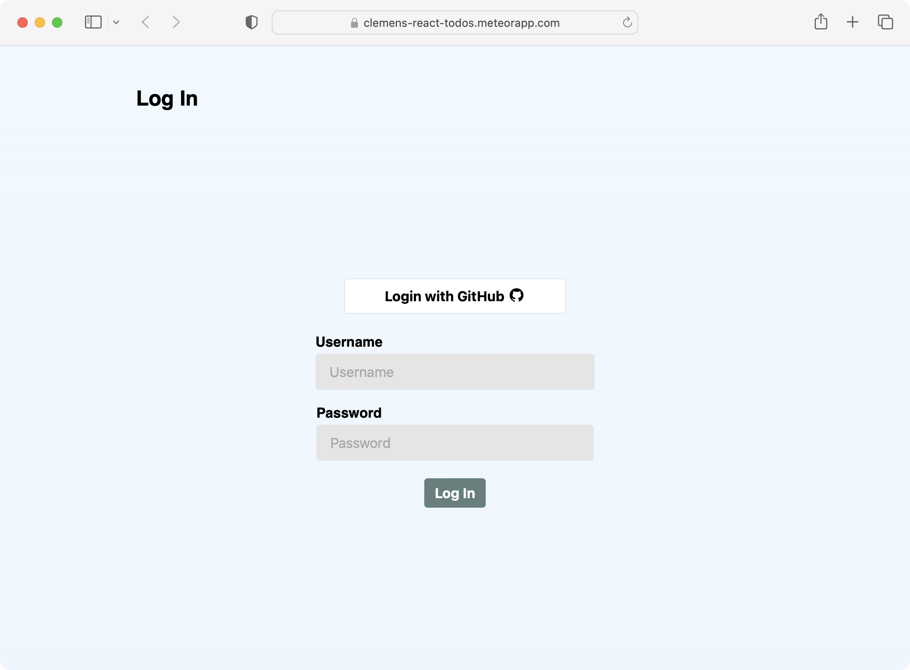
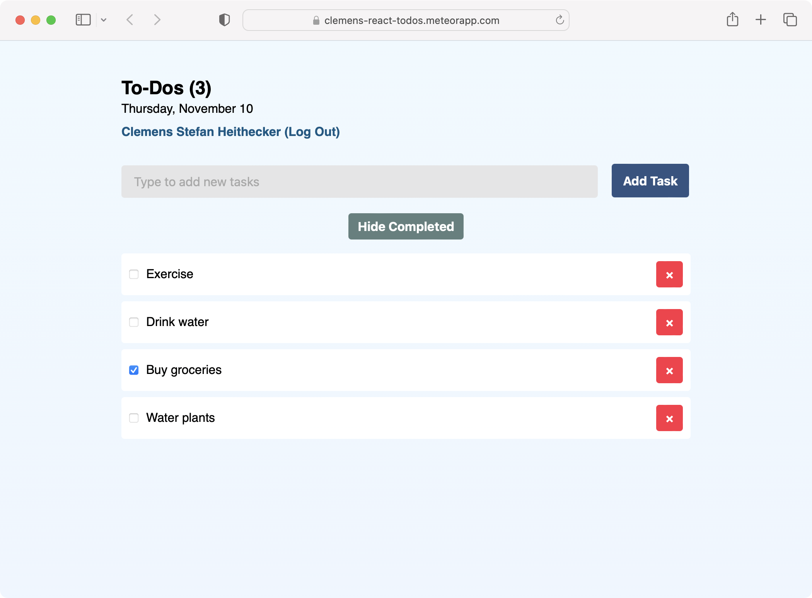

# Meteor React Tutorial: Simple Todos

A project to learn how to create a Simple Todos with Meteor and React. View the live demo at [clemens-react-todos.meteorapp.com](https://clemens-react-todos.meteorapp.com/).

Check out [the tutorial](https://react-tutorial.meteor.com/) on [meteor.com](https://www.meteor.com/).

The app features user sign-in and every user has a unique collection of tasks.

<p align="center">
    
</p>

Tasks can be marked as completed, filtered and removed.

<p align="center">
    
</p>

## Getting started

1. Install the dependencies.

   ```
   npm install
   ```

2. Run the Meteor app.

   ```
   npm start
   ```
